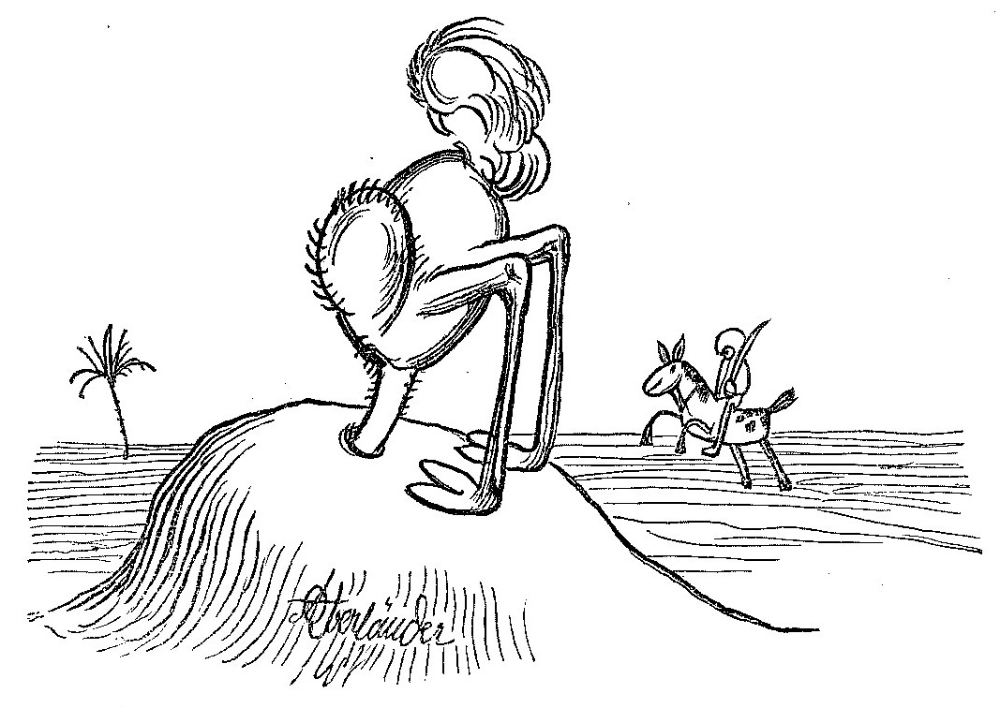

## Daten sind oft kaputt

* unvollständig, veraltet
* nicht so wie eigentlich gedacht
* _viele Möglichkeiten der Kaputtheit..._

## Validierung

* Automatisiertes Erkennen einiger Kaputtheit
* Validierungsregeln
    * Programmcode (`if not(...) then error`)
    * Schemasprachen

## Schemasprachen

* JSON Schema
* XMl Schema
* SHACL
* Avram
* Reguläre Ausdrücke
* ...

## Validierungsdienst

* Open Source Webservice
* Auch als Kommandozeilenclient nutzbar

[format.gbv.de/validate](https://format.gbv.de/validate/)

## Warum nicht mehr Validierung?

* Schlechte Useability von Werkzeugen?
* Validierungsregeln sind kompliziert?
* Fehlerreports sind unübersichtlich?
* Fehlende Workflows?
* ...?

---

